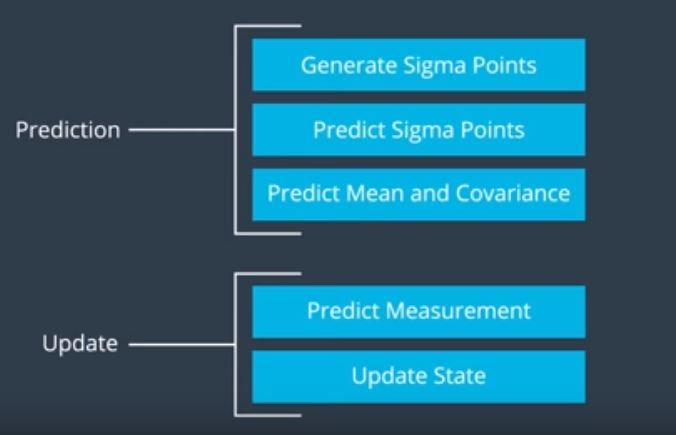
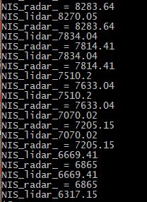
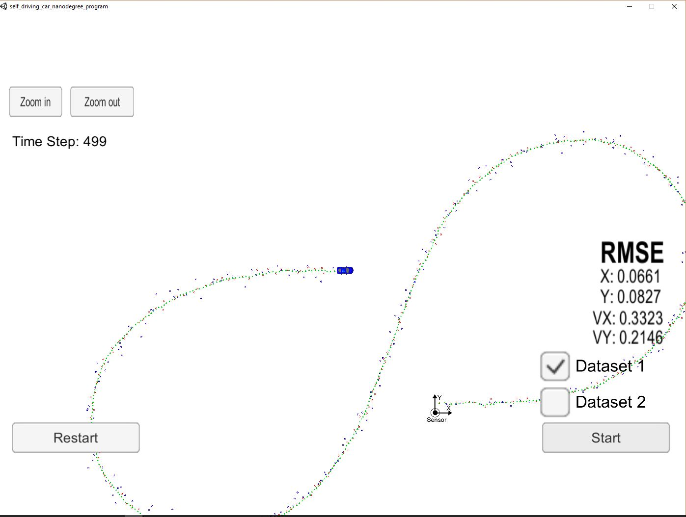
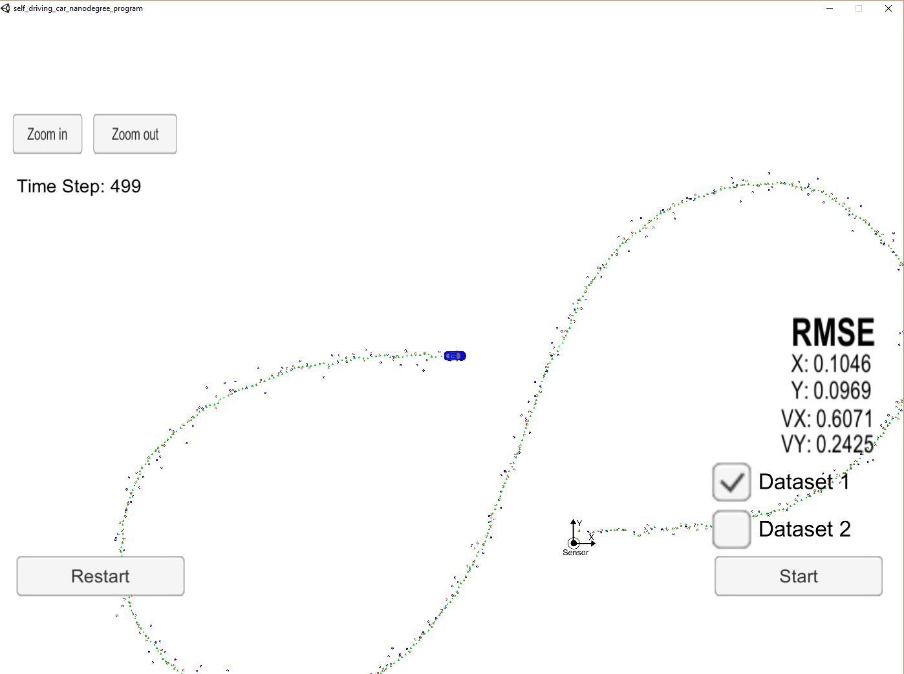
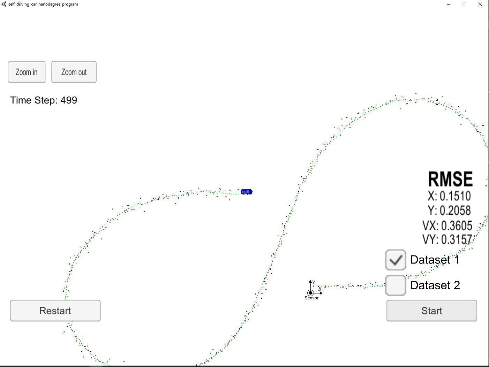

# Unscented Kalman Filter 

In this project, I utilize an Unscented Kalman Filter to estimate the state of a moving object of interest with noisy lidar and radar measurements. The radar measurements are provided in polar coordinates and includes speed data (from Doppler effect), while the lidar measurements only provide position data and no speed information.

The process flow used in this project is as follows:

## Building
To build:
* mkdir/cd build
* cmake ..
* make
* run ./UnscentedKF
* start the simulator found from [here](https://github.com/udacity/self-driving-car-sim/releases)

## Vehicle model
In this project, instead of using a constant velocity (CV) model as EKF, a constant turn rate and velocity magnitude model (CTRV) is used, to better model the driving behavior. The code for this model is found in ukf.cpp under UKF::ProcessModel (lines 314-347). This follows the suggestions to prevent errors when the yaw_rate is too small.

## Initialization/First measurement
The code for initlizing the kalman filter is found in the ukf.cpp file, lines 102 - 165. Depending on the type of sensor we get our first measurement from, we initilize and save the timestamp to be able to record \delta t for later calculations.

The initilization values here have been chosen by trial and error, this combination give adequate performance and matches the project rubric.

The F, P are also initilized. 

The weights for the sigma points are also calculated. Finally a check is done to ensure that the initial values are not too small.

## Kalman filter flow
The flow used for the unscented kalman filter is shown below:

### Prediction
After the first measurement, each time step starts with a prediction. In the unscented filter, instead of linearizing the model around one point like done in the EKF (which works for slightly nonlinear systems, but has problems for more nonlinear systems), a bunch of "sigma" points are generated from the a priori distribution, and tracked through the nonlinear model to later to approximate the now non-gaussian distribution with a gaussian one - calculating the mean and variance of the new pdf. 

The sigma points are generated in UKF::GenerateSigmaPoints in ukf.cpp lines 263-284. Since the noise is effected by the models nonlinearity, we augment/increase the state size to track the noise behavior. The points are generated in a matter to best capture the pdf behavior. Given enough sigma points, the new non-gaussian pdf can be approximated.

The next step is to evaluate the sigma points with respect to the model, to see where these points end up after the nonlinearity. This is done in UKF::PredictSigmaPoints and lines 286-293 in ukf.cpp. 

The final step for prediction is to calculate the weighted mean and covariance of these sigma points. This is done in the UKF::PredictMeanAndCovariance method in the ukf.cpp file, lines 295-312. Normalizing the angle between pi and -pi is the only important trick that is needed here.

### Update
After prediction, if the data is coming from the lidar we use a simple update function and compare the x and y position to those coming from the model for the all sigma points. However if the data comes from the radar, since it is nonlinear and uses polar coordinates, we need to first change to polar coordinates and then compare all sigma points.

Finally the NIS for lidar and radar sensors are calculated to evaluate the consistency of the parameters and the last few output values are shown below

# Final code and results
The code for this project is found under src directory, and a video has been captured to see the performance of kalman filtering (UKF_test.mp4). The final result is shown here. It can be seen that the falls below the maximum range in the rubric of RMSE <= [.09, .10, .40, .30].

Tests were done using only lidar and only radar measurements, which resulted in degraded performance. For example, using only lidar degraded the performance to:

In the case of only using the radar the performance degradation is as follows

It is interesting to compare these two cases. Using only lidar obtains better estimates on x and y compared to using only radar (although degraded compared to using both), but using radar only has better estimates on the speed in x and y direction. This is not unexpected as while lidar has better spatial resolution (and can give better estimates for x and y), it does not generate any speed information. The radar, using Doppler, does so it is capable of providing better speed estimates.

Obviously combining these two sensors greatly improves the performance, as the benefits of better position and speed compound.
